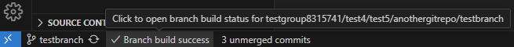
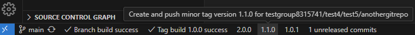

# Git Tag Release Tracker

[](https://marketplace.visualstudio.com/items?itemName=DanielChristianSchroeter.git-tag-release-tracker) [](https://marketplace.visualstudio.com/items?itemName=DanielChristianSchroeter.git-tag-release-tracker) [](https://open-vsx.org/extension/DanielChristianSchroeter/git-tag-release-tracker)

The **Git Tag Release Tracker** extension for VS Code simplifies Git tag and release management. Increment semantic versions (Major, Minor, Patch) with a single click in the status bar. Automatically tracks and displays CI/CD build status for your tags and branches for GitHub Actions and GitLab Pipelines.

## Features

- **Automatic Detection**: Identifies Git repository, branch, latest tags, and CI/CD system (GitHub Actions or GitLab Pipelines).
- **Status Bar Integration**: Displays unmerged and unreleased commits, latest tag version, and CI/CD status.
- **Tag Management**: Increment major, minor, or patch version tags while preserving existing prefixes and suffixes.
- **CI/CD Integration**: Shows build status for the latest tag and current branch.
- **Compare Commits**: Open a GitHub/GitLab compare link to view changes between tags/branches.
- **Automatic Updates**: Status bar updates build status on repository/branch changes and after any push.

**Note**: This extension only supports [Semantic Versioning](https://semver.org/) for tag management. Make sure your project follows the SemVer specification for optimal use of this extension.

### Default vs Feature Branch Status Bar

- **Default Branch**:

  - Buttons for creating new version tags (major, minor, patch) if tags exist.
  - Shows unreleased commits since the last tag.
  - Displays both latest tag and current branch build status.

- **Feature Branch**:
  - Hides version tag creation buttons.
  - Shows unreleased commits on the default branch and unmerged commits on the current branch.
  - Displays current branch build status.

### Screenshots

<p align="center">

<br/>
<em>Show your latest Github or GitLab branch build status</em>
</p>

<p align="center">

<br/>
<em>Default branch with unreleased commits and option to increase minor version</em>
</p>

<p align="center">

<br/>
<em>Feature branch showing unreleased and unmerged commits, along with branch build status</em>
</p>

## Requirements

- A Git repository with a configured remote (GitHub or GitLab).
- For CI/CD status checks, create a Personal Access Token with the following scopes:
  - For GitHub:
    - Go to Settings > Developer settings > Personal access tokens > Generate new token.
    - Select the `workflow` scope.
  - For GitLab:
    - Go to User Settings > Access Tokens.
    - Create a new token with the `read_api` scope.

## Extension Settings

- `gitTagReleaseTracker.ciProviders`: Configure CI providers (GitHub and GitLab).

## Setting up CI/CD Status Checks

1. Generate Personal Access Tokens as per the requirements.
2. Open VS Code settings (File > Preferences > Settings).
3. Add the following to `settings.json`:

   ```json
   "gitTagReleaseTracker.ciProviders": {
     "github": {
       "token": "your-github-token",
       "apiUrl": "https://api.github.com"
     },
     "gitlab": {
       "token": "your-gitlab-token",
       "apiUrl": "https://gitlab.com"  // or your self-hosted GitLab URL
     }
   }
   ```

   Replace token placeholders with actual tokens.

4. Update `apiUrl` for self-hosted GitLab instances.
5. Save your settings.

The extension will detect and use the appropriate CI system for each repository.

## Commands

- `Git Tag Release Tracker: Show Logs`: Open the extension's log output channel.

Access these commands through the Command Palette (Ctrl+Shift+P or Cmd+Shift+P on macOS).

## Semantic Versioning

This extension adheres to [Semantic Versioning 2.0.0](https://semver.org/). Understand the principles of SemVer:

1. MAJOR version for incompatible API changes,
2. MINOR version for adding functionality in a backwards compatible manner,
3. PATCH version for backwards compatible bug fixes.

## Troubleshooting

- Check extension logs via "Git Tag Release Tracker: Show Logs".
- Ensure CI tokens are correctly configured.
- Verify repository has a valid remote URL and is connected to GitHub or GitLab.

## Feedback and Contributions

Feedback and contributions are welcome! Submit issues or pull requests on the [GitHub repository](https://github.com/danielchristianschroeter/vscode-git-tag-release-tracker).
