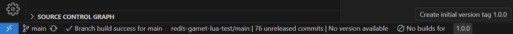
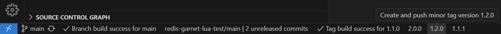
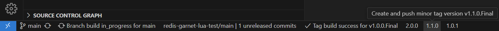
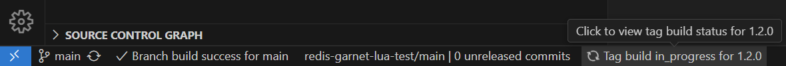
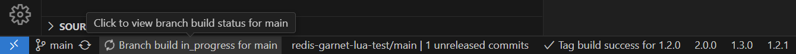

# Git Tag Release Tracker

The **Git Tag Release Tracker** extension for Visual Studio Code allows you to manage and track your Git tags and releases directly within Visual Studio Code. Easily increment your Major, Minor, or Patch semantic versioning with a single click in the status bar. This extension now supports both GitHub Actions and GitLab CI/CD pipelines with automatic detection.

## Features

- **Automatic Detection**: Automatically detects your Git repository, branch, the latest tags, and CI/CD system (GitHub Actions or GitLab CI).
- **Status Bar Integration**: Displays the number of unreleased commits, the latest tag version, and CI/CD status in the VS Code status bar.
- **Tag Management**: Provides buttons to create major, minor, and patch tags directly from the status bar.
- **Initial Tag Creation**: Easily create an initial version tag (1.0.0) if no tags are present.
- **Compare Commits**: Open a compare link to view changes between the latest tag and the current branch on GitHub/GitLab.
- **CI/CD Integration**: Shows the build status of the latest tag directly in the status bar for both GitHub Actions and GitLab CI/CD.
- **Manual Refresh**: Refresh the build status manually using the "Refresh Build Status" command. (This is needed because the status bar item is updated periodically, but not in response to all events.)

**Note**: This extension only supports [Semantic Versioning](https://semver.org/) for tag management. Make sure your project follows the SemVer specification for optimal use of this extension.

### Screenshots

<p align="center">

<br/>
<em>Easily create an initial version tag (1.0.0) if no tags are present.</em>
</p>

<p align="center">

<br/>
<em>Increase Major, Minor or Patch Version with just a single click.</em>
</p>

<p align="center">

<br/>
<em>Maintain existing prefixes and suffixes in the version tag structure.</em>
</p>

<p align="center">

<br/>
<em>Get current build status for Github Action Workflows or GitLab Pipelines for tag.</em>
</p>

<p align="center">

<br/>
<em>Get current build status for Github Action Workflows or GitLab Pipelines for branch.</em>
</p>

## Requirements

- A Git repository with a configured remote (GitHub or GitLab).
- For CI/CD status checks, create a Personal Access Token with the following scopes:
  - For GitHub:
    - Go to Settings > Developer settings > Personal access tokens > Generate new token.
    - Select the `workflow` scope.
  - For GitLab:
    - Go to User Settings > Access Tokens.
    - Create a new token with the `read_api` scope.

## Extension Settings

This extension contributes the following settings:

- `gitTagReleaseTracker.defaultBranch`: Specifies the default branch used for release versioning (e.g., main, master, production). Default is `main`.
- `gitTagReleaseTracker.ciProviders`: Configuration for different CI providers (GitHub and GitLab).

## Setting up CI/CD Status Checks

1. Generate Personal Access Tokens as per the requirements mentioned above.

2. Open your VS Code settings (File > Preferences > Settings).

3. Search for "Git Tag Release Tracker" and add the following configuration to your `settings.json`:

   ```json
   "gitTagReleaseTracker.ciProviders": {
     "github": {
       "token": "your-github-token-here",
       "apiUrl": "https://api.github.com"
     },
     "gitlab": {
       "token": "your-gitlab-token-here",
       "apiUrl": "https://gitlab.com"  // or your self-hosted GitLab URL
     }
   }
   ```

   Replace the token placeholders with your actual tokens.

4. For self-hosted GitLab instances, update the `apiUrl` accordingly.

5. Save your settings.

The extension will automatically detect and use the appropriate CI system for each repository.

Note: You can configure both GitHub and GitLab providers simultaneously if you work with both platforms.

## Commands

This extension contributes the following commands:

- `Git Tag Release Tracker: Refresh Branch Build Status`: Manually refresh the build status for the current branch.

You can access this command through the Command Palette (Ctrl+Shift+P or Cmd+Shift+P on macOS) by typing "Git Tag Release Tracker".

## Semantic Versioning

This extension adheres to Semantic Versioning 2.0.0 as defined at [semver.org](https://semver.org/). It's important to understand the principles of SemVer when using this extension:

1. MAJOR version for incompatible API changes,
2. MINOR version for adding functionality in a backwards compatible manner, and
3. PATCH version for backwards compatible bug fixes.

Additional labels for pre-release and build metadata are available as extensions to the MAJOR.MINOR.PATCH format.

For more details on Semantic Versioning, please refer to the [official SemVer specification](https://semver.org/).
