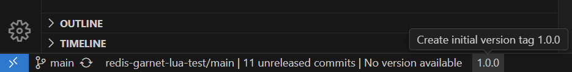

# Git Tag Release Tracker

The **Git Tag Release Tracker** extension for Visual Studio Code allows you to manage and track your Git tags and releases directly within Visual Studio Code. Easily increment your Major, Minor, or Patch semantic versioning with a single click in the status bar.

## Features

- **Automatic Detection**: Automatically detects your Git repository, branch, and the latest tags.
- **Status Bar Integration**: Displays the number of unreleased commits and the latest tag version in the VS Code status bar.
- **Tag Management**: Provides buttons to create major, minor, and patch tags directly from the status bar.
- **Initial Tag Creation**: Easily create an initial version tag (1.0.0) if no tags are present.
- **Compare Commits**: Open a compare link to view changes between the latest tag and the current branch on GitHub/GitLab.
- **CI/CD Integration**: Ideal for CI/CD workflows triggered by tag pushes.

### Screenshots

## Requirements

Ensure your current directory contains a Git repository with a configured remote (e.g., GitHub or GitLab).

## Extension Settings

This extension contributes the following settings:

- `gitTagReleaseTracker.defaultBranch`: Specifies the default branch used for release versioning (e.g., main, master, production). Default is `main`.

## Release Notes

### 1.0.0

- Initial release of Git Tag Release Tracker
