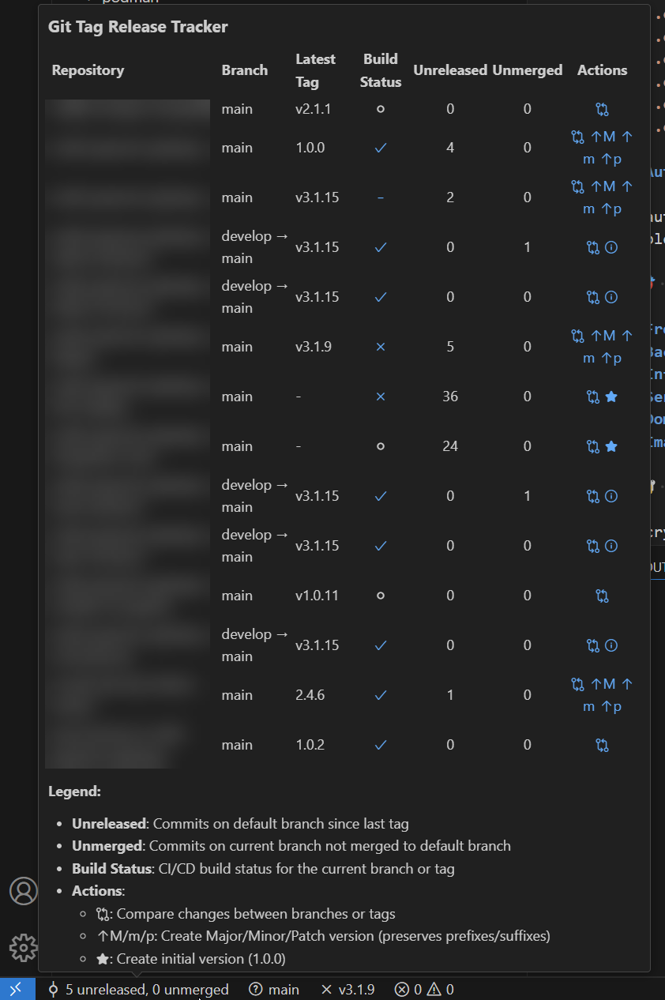

# Git Tag Release Tracker

[](https://marketplace.visualstudio.com/items?itemName=DanielChristianSchroeter.git-tag-release-tracker) [](https://marketplace.visualstudio.com/items?itemName=DanielChristianSchroeter.git-tag-release-tracker) [](https://open-vsx.org/extension/DanielChristianSchroeter/git-tag-release-tracker)

The **Git Tag Release Tracker** extension for VS Code simplifies Git tag and release management. Increment semantic versions (Major, Minor, Patch) with a single click in the hover menu. Automatically tracks and displays CI/CD build status for your tags and branches for GitHub Actions and GitLab Pipelines.

## Features

- **Automatic Detection**: Identifies Git repository, branch, latest tags, and CI/CD system (GitHub Actions or GitLab Pipelines).
- **Multi-Repo Dashboard**: Hover over the status bar item to see a detailed dashboard with the status of all repositories in your workspace.
- **Status Bar Integration**: Displays an aggregated count of unmerged and unreleased commits from all repositories with loading indicators.
- **Tag Management**: Increment major, minor, or patch version tags while preserving existing prefixes and suffixes.
- **CI/CD Integration**: Shows build status for the latest tag and current branch with clickable links to pipelines.
- **Compare Commits**: Open a GitHub/GitLab compare link to view changes between tags/branches.
- **Automatic Updates**: Status bar updates build status on repository/branch changes and after any push.
- **Real-Time Polling & Smart Caching**: Build statuses refresh automatically every 5 seconds while completed results are cached to keep the extension responsive.
- **Active-File Aware Actions**: Version-increment buttons and Quick Pick menus automatically target the repository of your currently active file.

**Note**: This extension only supports [Semantic Versioning](https://semver.org/) for tag management. Make sure your project follows the SemVer specification for optimal use of this extension.

### Multi-Repo Dashboard

The status bar provides an at-a-glance summary of all your repositories. For a detailed breakdown, simply hover over the status bar item. A rich tooltip will appear, showing a table with the following information for each repository:

- **Repository Name**: The name of the repository folder.
- **Current Branch**: The currently checked-out branch and its relationship to the default branch.
- **Latest Tag**: The most recent version tag.
- **Build Status**: CI/CD build status for the current branch or tag with clickable links to pipelines.
- **Unreleased Commits**: The number of commits on the default branch since the latest tag.
- **Unmerged Commits**: The number of commits on your feature branch that are not yet in the default branch.
- **Actions**: Icons for comparing changes and creating new version tags.

### Version Management

When working on the default branch with unreleased commits, you'll see version increment buttons in the hover menu:

- **Major (M)**: Increment the first number (e.g., 1.0.0 → 2.0.0)
- **Minor (m)**: Increment the second number (e.g., 1.0.0 → 1.1.0)
- **Patch (p)**: Increment the third number (e.g., 1.0.0 → 1.0.1)
- **Initial**: Create first tag (1.0.0) for repositories with no tags

All version increments preserve any existing prefixes or suffixes in your tags (e.g., "v1.0.0-beta" → "v1.1.0-beta").

### Build Status Indicators

The extension shows build status for both branches and tags with intuitive icons:

- **Success**: ✓ (green checkmark)
- **Failure**: ✗ (red X)
- **Running**: ↻ (spinning icon)
- **Pending**: ⏱ (clock icon)
- **Cancelled**: ⊘ (cancelled icon)

Clicking on a build status icon takes you directly to the corresponding CI/CD pipeline.

### Screenshots

<p align="center">

<br/>
<em>See all your repos in one view with your unreleased / unmerged commits with your current Github or GitLab branch or tag build status</em>
</p>

## Requirements

- A Git repository with a configured remote (GitHub or GitLab).
- For CI/CD status checks, create a Personal Access Token with the following scopes:
  - For GitHub:
    - Go to Settings > Developer settings > Personal access tokens > Generate new token.
    - Select the `workflow` scope.
  - For GitLab:
    - Go to User Settings > Access Tokens.
    - Create a new token with the `read_api` scope.

## Extension Settings

- `gitTagReleaseTracker.ciProviders`: Configure CI providers (GitHub and GitLab).

## Setting up CI/CD Status Checks

1. Generate Personal Access Tokens as per the requirements.
2. Open VS Code settings (File > Preferences > Settings).
3. Add the following to `settings.json`:

   ```json
   "gitTagReleaseTracker.ciProviders": {
     "github": {
       "token": "your-github-token",
       "apiUrl": "https://api.github.com"
     },
     "gitlab": {
       "token": "your-gitlab-token",
       "apiUrl": "https://gitlab.com/api/v4"  // or your self-hosted GitLab URL
     }
   }
   ```

   Replace token placeholders with actual tokens.

4. Update `apiUrl` for self-hosted GitLab instances.
5. Save your settings.

The extension will detect and use the appropriate CI system for each repository.

## Commands

- `Git Tag Release Tracker: Show Logs`: Open the extension's log output channel.
- `Git Tag Release Tracker: Refresh Dashboard`: Manually clear the cache and refresh build status / commit counts.

Access these commands through the Command Palette (Ctrl+Shift+P or Cmd+Shift+P on macOS).

## Semantic Versioning

This extension adheres to [Semantic Versioning 2.0.0](https://semver.org/). Understand the principles of SemVer:

1. MAJOR version for incompatible API changes,
2. MINOR version for adding functionality in a backwards compatible manner,
3. PATCH version for backwards compatible bug fixes.

## Troubleshooting

- Check extension logs via "Git Tag Release Tracker: Show Logs".
- Ensure CI tokens are correctly configured.
- Verify repository has a valid remote URL and is connected to GitHub or GitLab.
- If you see "Loading..." for an extended period, try switching between files or refreshing VS Code.
- If build status isn't showing, verify your CI/CD configuration and tokens.

## Feedback and Contributions

Feedback and contributions are welcome! Submit issues or pull requests on the [GitHub repository](https://github.com/danielchristianschroeter/vscode-git-tag-release-tracker).
