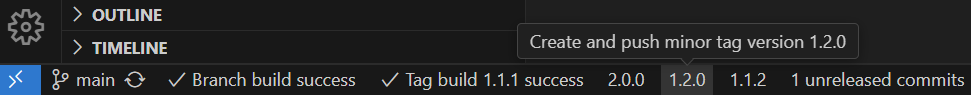
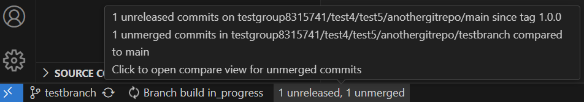

# Git Tag Release Tracker

[](https://marketplace.visualstudio.com/items?itemName=DanielChristianSchroeter.git-tag-release-tracker) [](https://marketplace.visualstudio.com/items?itemName=DanielChristianSchroeter.git-tag-release-tracker) [](https://open-vsx.org/extension/DanielChristianSchroeter/git-tag-release-tracker)

The **Git Tag Release Tracker** extension for VS Code simplifies Git tag and release management. Increment semantic versions (Major, Minor, Patch) with a single click in the status bar. Automatically tracks and displays CI/CD build status for your tags and branches.

## Features

- **Automatic Detection**: Detects Git repository, branch, latest tags, and CI/CD system (GitHub Actions or GitLab Pipelines).
- **Status Bar Integration**: Shows unmerged and unreleased commits, latest tag version, and CI/CD status.
- **Tag Management**: Increase major, minor, or patch version tags from the status bar. If existing tags are present, it preserves existing prefixes and suffixes from the latest tag.
- **CI/CD Integration**: Displays build status for latest tag and current branch.
- **Compare Commits**: Open a GitHub/GitLab compare link to view changes between tags/branches.
- **Automatic Updates**: Status bar automatically updates build status on repository and/or branch changes, as well as after any push.

**Note**: This extension only supports [Semantic Versioning](https://semver.org/) for tag management. Make sure your project follows the SemVer specification for optimal use of this extension.

### Default Branch vs Feature Branch Status Bar

When you're on the default branch (e.g., main or master):

- You'll see buttons for creating new version tags (major, minor, patch) if existing tags exist.
- The status bar shows the number of unreleased commits since the last tag.
- Both the latest tag build status and the current branch build status are displayed.

When you're on any other (feature/topic) branch:

- Version tag creation buttons are hidden.
- The status bar shows both unreleased commits on the default branch and unmerged commits on your current branch.
- The current branch build status is displayed.

### Screenshots

<p align="center">

<br/>
<em>Default branch with unreleased commits and option to increase minor version</em>
</p>

<p align="center">

<br/>
<em>Creating an initial version tag on the default branch</em>
</p>

<p align="center">

<br/>
<em>Creating a minor tag on the default branch</em>
</p>

<p align="center">

<br/>
<em>Notification showing the result of a tag build status check</em>
</p>

<p align="center">

<br/>
<em>Status bar showing tag build status on the default branch</em>
</p>

<p align="center">

<br/>
<em>Feature branch showing unreleased and unmerged commits, along with branch build status</em>
</p>

## Requirements

- A Git repository with a configured remote (GitHub or GitLab).
- For CI/CD status checks, create a Personal Access Token with the following scopes:
  - For GitHub:
    - Go to Settings > Developer settings > Personal access tokens > Generate new token.
    - Select the `workflow` scope.
  - For GitLab:
    - Go to User Settings > Access Tokens.
    - Create a new token with the `read_api` scope.

## Extension Settings

This extension contributes the following setting:

- `gitTagReleaseTracker.ciProviders`: Configuration for different CI providers (GitHub and GitLab).

## Setting up CI/CD Status Checks

1. Generate Personal Access Tokens as per the requirements mentioned above.

2. Open your VS Code settings (File > Preferences > Settings).

3. Search for "Git Tag Release Tracker" and add the following configuration to your `settings.json`:

   ```json
   "gitTagReleaseTracker.ciProviders": {
     "github": {
       "token": "your-github-token",
       "apiUrl": "https://api.github.com"
     },
     "gitlab": {
       "token": "your-gitlab-token",
       "apiUrl": "https://gitlab.com"  // or your self-hosted GitLab URL
     }
   }
   ```

   Replace the token placeholders with your actual tokens.

4. For self-hosted GitLab instances, update the `apiUrl` accordingly.

5. Save your settings.

The extension will automatically detect and use the appropriate CI system for each repository.

Note: You can configure both GitHub and GitLab providers simultaneously if you work with both platforms.

## Commands

This extension contributes the following commands:

- `Git Tag Release Tracker: Refresh Branch Build Status`: Manually force refresh the build status for the current branch.
- `Git Tag Release Tracker: Show Logs`: Open the extension's log output channel.

You can access these commands through the Command Palette (Ctrl+Shift+P or Cmd+Shift+P on macOS) by typing "Git Tag Release Tracker".

## Semantic Versioning

This extension adheres to Semantic Versioning 2.0.0 as defined at [semver.org](https://semver.org/). It's important to understand the principles of SemVer when using this extension:

1. MAJOR version for incompatible API changes,
2. MINOR version for adding functionality in a backwards compatible manner, and
3. PATCH version for backwards compatible bug fixes.

Additional labels for pre-release and build metadata are available as extensions to the MAJOR.MINOR.PATCH format.

For more details on Semantic Versioning, please refer to the [official SemVer specification](https://semver.org/).

## Troubleshooting

If you encounter any issues:

1. Check the extension logs by running the "Git Tag Release Tracker: Show Logs" command.
2. Ensure your CI tokens are correctly configured in the extension settings.
3. Verify that your repository has a valid remote URL and is properly connected to GitHub or GitLab.

## Feedback and Contributions

Your feedback and contributions are welcome! Please submit issues or pull requests on the [GitHub repository](https://github.com/danielchristianschroeter/vscode-git-tag-release-tracker).
